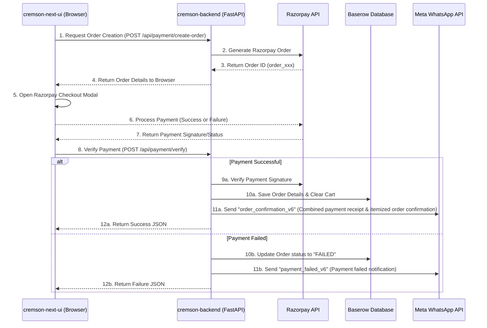
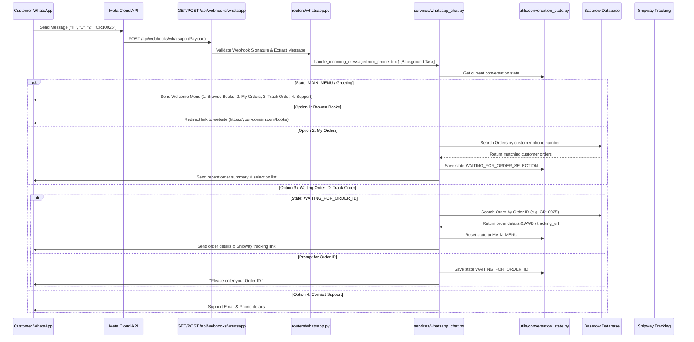

# Cremson Backend

A FastAPI backend for the Cremson Publications storefront. It integrates with Baserow (as the database), Razorpay (for payment processing), and Meta's Cloud API (for WhatsApp notifications).

---

## 🛠️ Tech Stack & Services
- **Framework**: FastAPI (Python 3)
- **Database**: Baserow (NoSQL/headless database client)
- **Payment Gateway**: Razorpay
- **Notifications**: Meta WhatsApp Business Cloud API

---

## 🚀 Setup & Installation

1. **Virtual Environment**:
   ```bash
   python3 -m venv venv
   source venv/bin/activate
   ```
2. **Install Dependencies**:
   ```bash
   pip install -r requirements.txt
   ```
3. **Environment Variables**:
   Create a `.env` file in the root of `cremson-backend/` containing:
   ```env
   # Baserow API Configuration
   BASEROW_API_URL=https://api.baserow.io
   BASEROW_API_TOKEN=your_baserow_token

   # Razorpay API Keys
   RAZORPAY_KEY_ID=your_razorpay_key_id
   RAZORPAY_KEY_SECRET=your_razorpay_key_secret

   # WhatsApp Meta API
   WHATSAPP_ACCESS_TOKEN=your_meta_access_token
   WHATSAPP_PHONE_NUMBER_ID=your_whatsapp_phone_number_id
   WHATSAPP_TEMPLATE_NAME=order_confirmation_v2
   WHATSAPP_TEMPLATE_LANGUAGE=en
   WHATSAPP_MAIN_PHONE=your_business_phone_number
   ```

---

## 🔄 Application & Payment Flow



### 1. Payment Verification (`/api/payment/verify`)
- The endpoint accepts the Razorpay payment details (`razorpay_order_id`, `razorpay_payment_id`, `razorpay_signature`).
- If successful, it initiates the order state transition and registers the purchase in Baserow.

### 2. WhatsApp Notification System (`services/whatsapp.py`)
If checkout succeeds, **a single combined notification** is dispatched to the customer:
1. **Order & Payment Confirmation (`order_confirmation_v6`)**: Combines payment success message (with Transaction ID), itemized list of books purchased, quantities, unit prices, and total order amount into a single message.

If checkout fails (failed/cancelled payment), **only one notification** is dispatched:
1. **Payment Failed (`payment_failed_v6`)**: Notifies the customer of the failed transaction.

---

## 📋 Meta Template Wording Definitions

### 1. Order & Payment Confirmation (`order_confirmation_v6`)
```text
Hello {{1}},

Great news! Your payment for Order *{{2}}* was successful and your order has been placed.
Transaction ID: {{3}}

📦 *Items Purchased:*
{{4}}

💰 *Total Amount:* *{{5}}*

We are now processing your order. Thank you for shopping with Cremson Publications!
```

### 2. Payment Failed (`payment_failed_v6`)
```text
Hello {{1}},

We noticed that your payment of {{2}} for Order {{3}} failed or was cancelled. 

Thank you!
```

---

## 💬 WhatsApp Conversational Chat Flow

### Architecture Diagram


### Incoming Webhook
- **GET `/api/webhooks/whatsapp`**: Webhook verification endpoint for Meta Graph API setup (`hub.challenge`).
- **POST `/api/webhooks/whatsapp`**: Webhook endpoint that receives incoming customer messages and processes them asynchronously via `services/whatsapp_chat.py`.

### Menu Structure & Conversation Flow
- **Greeting (`Hi` / `Hello` / `Start`)**:
  - Displays welcome greeting and options 1-4.
- **1️⃣ Browse Books**:
  - Directs customer to `https://your-domain.com/books`.
- **2️⃣ My Orders**:
  - Looks up Baserow Orders table using sender phone number (`from` phone from Meta webhook).
  - Returns recent orders list and prompts user to select an order number for detailed breakdown and tracking link.
- **3️⃣ Track Order**:
  - Prompts user for Order ID (e.g., `CR10025` or `BOOK5`).
  - Searches Baserow by `order_id` and returns status, courier name, AWB, and direct Shipway tracking link.
- **4️⃣ Contact Support**:
  - Returns Cremson Publications support email and phone details.

### State Management
- Managed in-memory via `utils/conversation_state.py` with automatic expiration (TTL = 30 mins).
- Zero database schema changes required.
